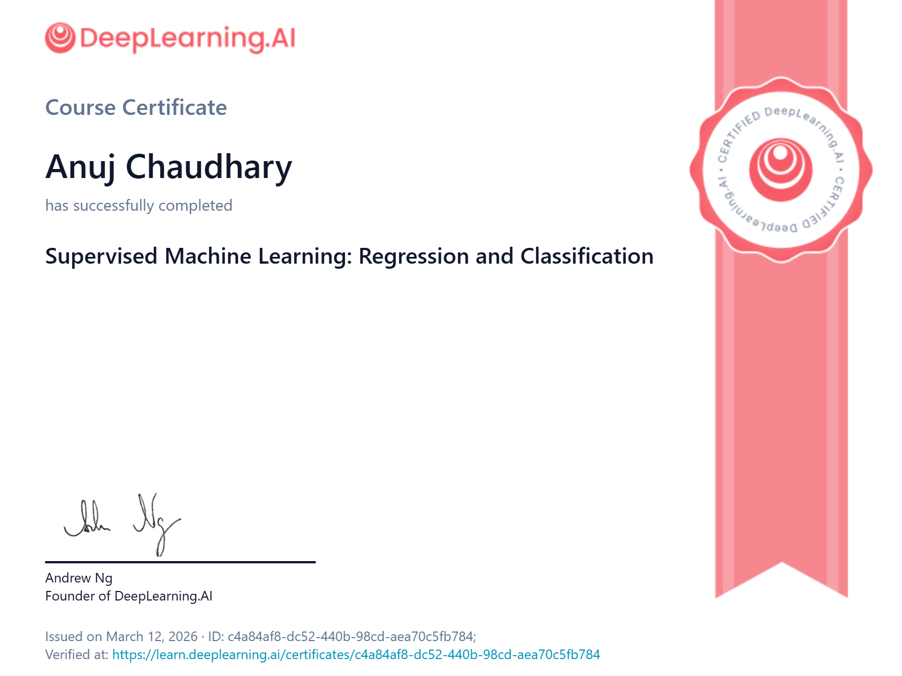

# Andrew Ng's Machine Learning Specialization

## Course 1: Supervised Machine Learning — Regression and Classification

This repository contains my **personal notes, Jupyter notebooks, and assignments** for **Course 1 of the Machine Learning Specialization** taught by **Andrew Ng** on **DeepLearning.AI (Coursera)**.

The course introduces the **fundamental concepts of supervised machine learning**, including regression, classification, cost functions, gradient descent, and regularization.

---

# 📜 Certificate

<p align="center">

</p>

🔗 **Certificate Verification:**
[View Certificate](https://learn.deeplearning.ai/certificates/c4a84af8-dc52-440b-98cd-aea70c5fb784?usp=sharing)

---

# 📚 Specialization Information

**Specialization:** Machine Learning Specialization by Andrew Ng
**Course:** Supervised Machine Learning: Regression and Classification
**Instructor:** Andrew Ng
**Platform:** Coursera / DeepLearning.AI

---

# 📂 Repository Structure

```
Machine-Learning-Specialization-by-Andrew-Ng
│
└── Course 1: Supervised Machine Learning: Regression and Classification
    │
    ├── Week 1: Introduction to Machine Learning
    ├── Week 2: Regression with multiple input variables
    └── Week 3: Classification
```

---

# Week 1: Introduction to Machine Learning

### Key Concepts and Notebooks

* **Supervised & Unsupervised Learning**
  Lecture notes and practice quiz.

* **Regression Model**
  Practical implementation of linear regression.

* **Cost Function**
  Understanding the cost function and its role in training models.

* **Gradient Descent**
  Detailed implementation and model training using gradient descent.

---

# Week 2: Regression with Multiple Input Variables

### Key Concepts and Notebooks

* **Vectorization**
  Optimizing implementations using NumPy vectorization.

* **Multiple Linear Regression**
  Practical implementation with multiple features.

* **Practice Quizzes**
  Exercises related to multiple linear regression.

* **Feature Scaling and Learning Rate Optimization**

* **Polynomial Regression**

* **Scikit-Learn Implementation**
  Using `sklearn` for linear regression and gradient descent.

---

# Week 3: Classification

### Key Concepts and Notebooks

* **Classification with Logistic Regression**

* **Sigmoid Function**
  Properties and practical implementation.

* **Decision Boundary**

* **Cost Function for Logistic Regression**

* **Gradient Descent for Logistic Regression**

* **Logistic Regression using Scikit-Learn**

* **Practice Quizzes on Classification**

* **The Problem of Overfitting**

* **Regularization for Linear and Logistic Regression**

---

# 🧠 Skills Learned

* Linear Regression
* Logistic Regression
* Gradient Descent Optimization
* Feature Scaling
* Vectorization with NumPy
* Model Evaluation
* Overfitting and Regularization

---

# 🛠 Technologies Used

* Python
* NumPy
* Scikit-Learn
* Jupyter Notebook
* Google Colab
* Matplotlib

---

# 👨‍💻 Author

**Anuj Chaudhary**

GitHub:
https://github.com/beingAnujChaudhary

---

⭐ If you found this repository useful, feel free to star it!
