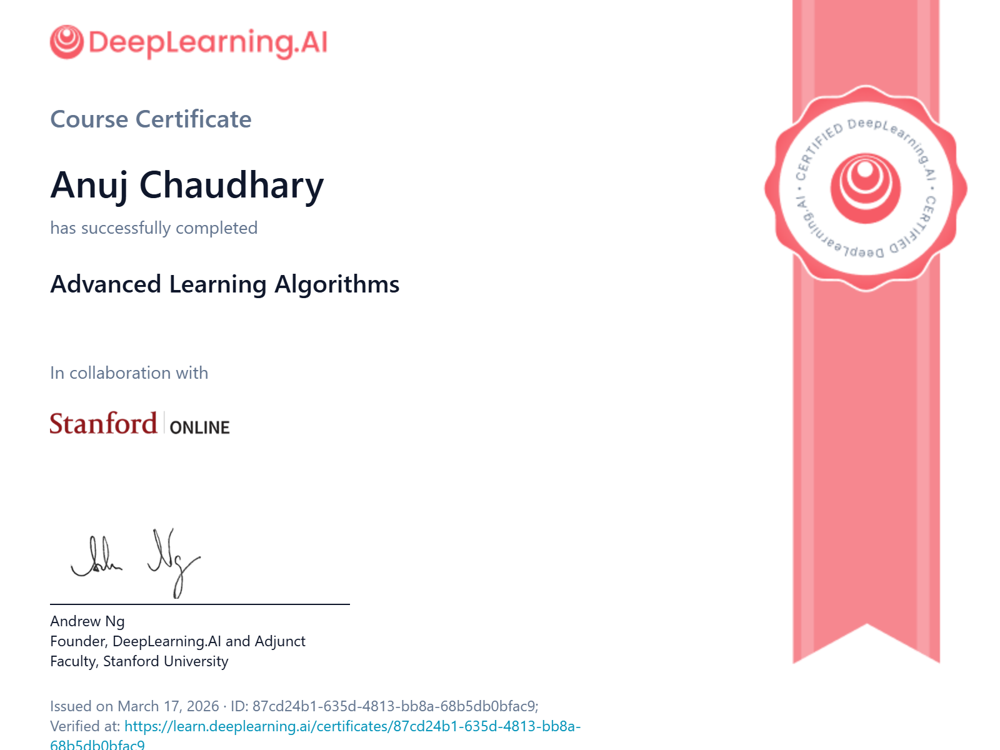

# Andrew Ng's Machine Learning Specialization

## Course 2: Advanced Learning Algorithms

This repository contains my **personal notes, Jupyter notebooks, and assignments** for **Course 2 of the Machine Learning Specialization** taught by **Andrew Ng** on **DeepLearning.AI (Coursera)**.

This course dives deeper into **neural networks, training techniques, decision trees, and best practices for applying machine learning in real-world systems**.

---

# 📜 Certificate

<p align="center">

</p>

🔗 **Certificate Verification:**
*(Add your Course 2 certificate link here)*

---

# 📚 Specialization Information

**Specialization:** Machine Learning Specialization by Andrew Ng
**Course:** Advanced Learning Algorithms
**Instructor:** Andrew Ng
**Platform:** Coursera / DeepLearning.AI

---

# 📂 Repository Structure

```
Machine-Learning-Specialization-by-Andrew-Ng
│
└── Course 2: Advanced Learning Algorithms
    │
    ├── Week 1: Neural Networks
    ├── Week 2: Neural Network Training
    ├── Week 3: Advice for Applying Machine Learning
    └── Week 4: Decision Trees
```

---

# Week 1: Neural Networks

### Key Concepts and Notebooks

* **Neural Networks Intuition**

  * Biological inspiration (neurons & brain)
  * Demand prediction
  * Image recognition

* **Neural Network Model**

  * Layers and architecture
  * Forward propagation (inference)
  * Multi-layer networks

* **TensorFlow Implementation**

  * Building neural networks using TensorFlow
  * Data handling and model creation
  * Coffee roasting example

* **Neural Network Implementation in Python**

  * Forward propagation using NumPy
  * Vectorized implementation

* **Vectorization (Optional)**

  * Efficient computation using matrix multiplication

* **AGI Discussion (Optional)**

* **Practice Lab**

  * Neural Networks for Binary Classification

---

# Week 2: Neural Network Training

### Key Concepts and Notebooks

* **Training Neural Networks**

  * Training pipeline and workflow

* **Activation Functions**

  * Sigmoid vs ReLU
  * Choosing the right activation

* **Multiclass Classification**

  * Softmax function
  * Multi-output classification

* **Additional Neural Network Concepts**

  * Advanced optimization
  * Additional layer types

* **Backpropagation (Optional)**

  * Derivatives and computation graphs

* **Practice Lab**

  * Neural Networks for Multiclass Classification

---

# Week 3: Advice for Applying Machine Learning

### Key Concepts and Notebooks

* **Model Evaluation & Selection**

  * Train/validation/test splits
  * Performance evaluation

* **Bias and Variance**

  * Diagnosing underfitting vs overfitting
  * Learning curves
  * Regularization

* **Machine Learning Development Process**

  * Iterative improvement loop
  * Error analysis
  * Data-centric AI approach
  * Transfer learning
  * Ethics & fairness

* **Skewed Datasets (Optional)**

  * Precision vs recall
  * Evaluation metrics for imbalanced data

* **Practice Lab**

  * Applying ML strategies effectively

---

# Week 4: Decision Trees

### Key Concepts and Notebooks

* **Decision Tree Model**

  * Tree structure and splitting

* **Decision Tree Learning**

  * Information gain
  * Entropy and purity
  * Handling categorical & continuous data

* **Tree Ensembles**

  * Random Forest
  * XGBoost
  * Sampling with replacement (bagging)

* **Practice Lab**

  * Decision Trees Implementation

---

# 🧠 Skills Learned

* Neural Networks (Deep Learning Basics)
* Forward & Backpropagation
* TensorFlow Implementation
* Multiclass Classification (Softmax)
* Bias-Variance Tradeoff
* Model Evaluation & Debugging
* Decision Trees & Ensemble Methods
* Real-world ML System Design

---

# 🛠 Technologies Used

* Python
* NumPy
* TensorFlow
* Scikit-Learn
* Jupyter Notebook
* Google Colab

---

# 👨‍💻 Author

**Anuj Chaudhary**

GitHub:
[https://github.com/beingAnujChaudhary](https://github.com/beingAnujChaudhary)

---

⭐ If you found this repository useful, feel free to star it!
